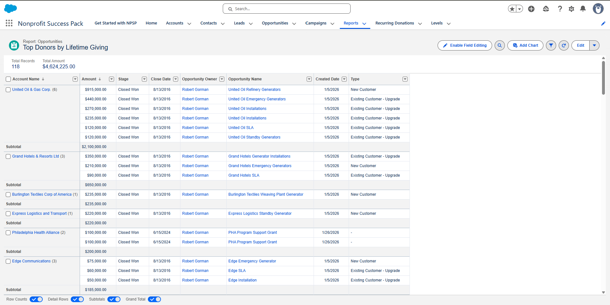
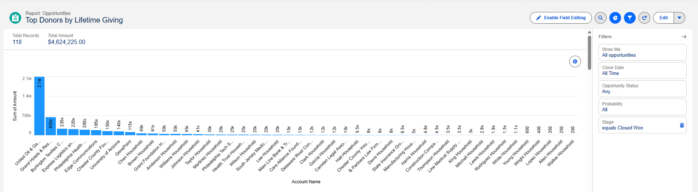
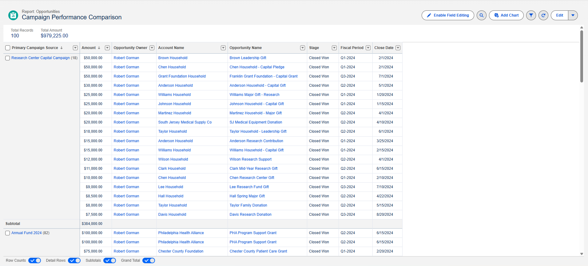
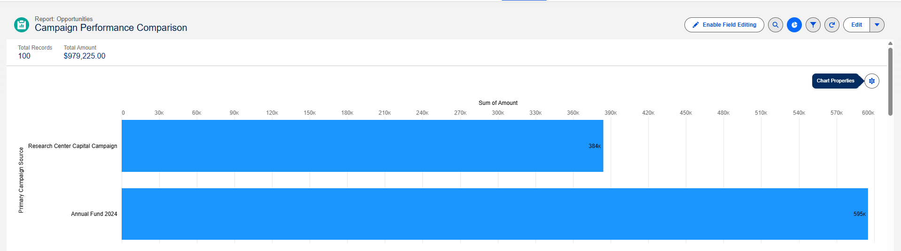
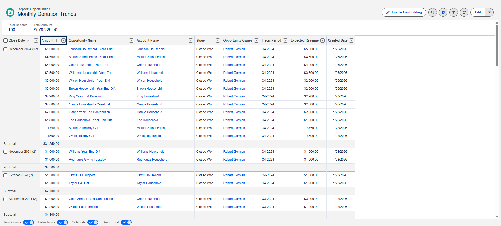
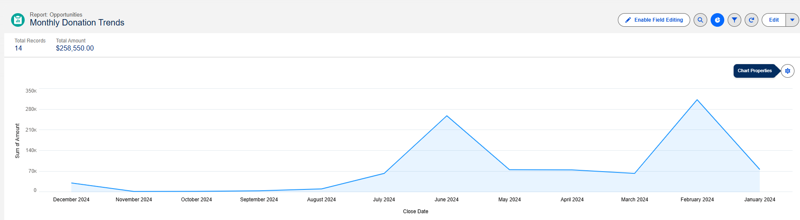

# Salesforce NPSP Fundraising Database

Built a nonprofit fundraising database in Salesforce NPSP. Imported a bunch of data, broke a bunch of things, fixed them, and made some reports.

## What's In Here

- 224 contacts, 12 organizations
- $1.35M in donations (individual gifts, foundation grants, corporate partnerships)
- 14 recurring donors
- 7 reports + dashboard

## Data Files

| File | Description |
|------|-------------|
| [contacts_data_with_batch.csv](data/contacts_data_with_batch.csv) | 224 contacts with household accounts |
| [donations_npsp.csv](data/donations_npsp.csv) | Individual donations ($188K) |
| [foundation_grants_import.csv](data/foundation_grants_import.csv) | Foundation grants ($1.07M) |
| [corporate_donations.csv](data/corporate_donations.csv) | Corporate partnerships ($90K) |
| [recurring_donations.csv](data/recurring_donations.csv) | Monthly sustainers ($1,035/month) |

## Things That Broke (and How I Fixed Them)

| Problem | Fix |
|---------|-----|
| Fields wouldn't auto-map | Use labels (`Account1 Name`) not API names (`npsp__Account1_Name__c`) |
| "Invalid Donation Donor" error | Add `Donation Donor` column = `Account1` for orgs, `Contact1` for people |
| Batch showed 0 records | Add `NPSP Data Import Batch` column with exact batch name |
| Recurring donations failed | Enable Enhanced Recurring Donations in NPSP Settings first |

## CSV Template That Works

```csv
Account1 Name,Donation Amount,Donation Date,Donation Stage,Donation Donor,NPSP Data Import Batch
Some Foundation,50000,2024-01-15,Closed Won,Account1,Your Batch Name Here
```

The key fields everyone forgets: `Donation Donor` and `NPSP Data Import Batch`. You're welcome.

## Reports

### Top Donors by Lifetime Giving
Shows total giving by account, sorted highest to lowest.





---

### Campaign Performance Comparison
Compares fundraising totals across campaigns (Annual Fund vs Capital Campaign).





---

### Monthly Donation Trends
Line chart showing donation patterns over time.





---

## What I'd Do Differently

- Start with clean data - spent way too much time fixing field mapping issues
- Create batches before importing - the batch has to exist first or the import fails silently
- Enable Enhanced Recurring Donations upfront - don't wait until you're trying to import recurring gifts
- Test with 5 records first - would've caught errors faster

---

